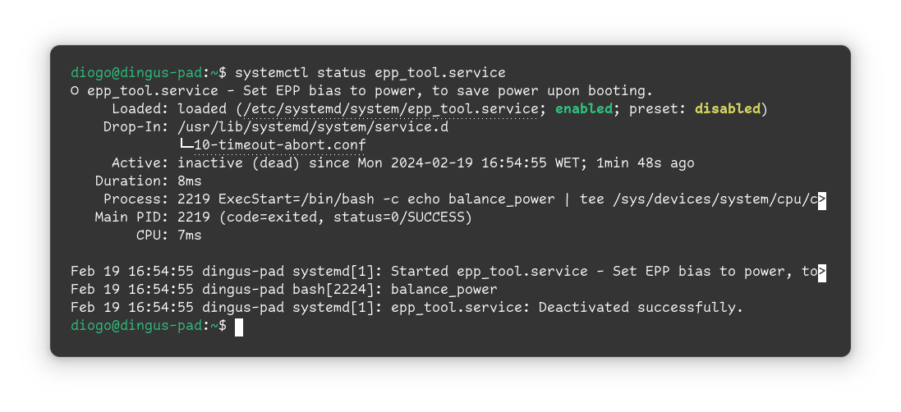
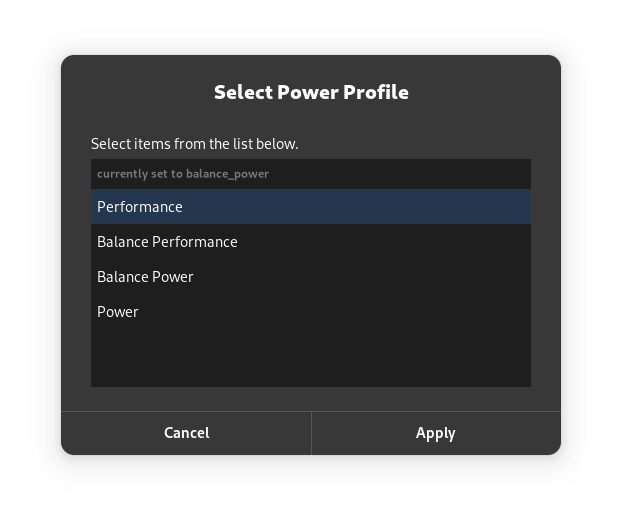

## What is this?

### epp_tool

[epp_tool](https://github.com/diogotavc/epp_tool) ~~(very creative, indeed)~~ aims to provide a very simple service to set, during boot, the epp bias to something more conservative (defaults to performance), and to provide a very quick way to toggle between modes afterwards.

Service                    |  GUI Tool
:-------------------------:|:-------------------------:
  |  

### EPP bias?

Kernel 6.3 now supports a new scalling driver for AMD, `amd_pstate=active` (read about it on the [Linux Kernel documentation](https://docs.kernel.org/admin-guide/pm/amd-pstate.html#active-mode) or on the [ArchWiki](https://wiki.archlinux.org/title/CPU_frequency_scaling#amd_pstate)). Whilst there's also a new guided mode in the AMD driver, I've seen better results with the slightly older active mode. My testing was very superficial and rudimentary, so take it with a grain of salt.

Intel has had a similar scaling driver for a few years and, as such, should be supported on all modern kernels (read about it on the [Linux Kernel documentation](https://docs.kernel.org/admin-guide/pm/intel_pstate.html#active-mode)).

**TL;DR:** the driver provides a hint to the hardware whether to bias toward performance or energy efficiency.

### Why would I need it?

Whilst I haven't tested on other machines, I've seen tangible gains in battery life on my machine, so I decided to make a repository for it. Some improvements and updates may or may not come, so use this as a base, if you need it for yourself.

## How to get it started?

### Enabling the correct scaling driver

Before beginning, make sure you've enabled the correct scaling driver:

```cat /sys/devices/system/cpu/cpu0/cpufreq/scaling_driver```

If the output is `amd-pstate-epp` or `intel_pstate`, you're all set. If not, you will have to add the correct kernel argument for it to be enabled.

- For AMD, you can enable it manually or use `grubby --update-kernel=ALL --args="amd_pstate=active"` (not forgetting to remove the old arguments). The procedure is similar for EFISTUB, systemd-boot and so on.
- For Intel, `intel_pstate` in its active mode should be the default basically everywhere. If it isn't, it should be the same as for AMD, except `amd_pstate=active` becomes `intel_pstate`.

### Moving and enabling the service

Time to copy the [unit file](epp_tool.service) to the correct location (`/etc/systemd/system/` for Fedora). If you want to change the bias to something other than `balance_power`, make sure to modify the service accordingly.

To make sure systemd is aware of the new service, reload its service files with `systemctl daemon-reload`. You may now enable the service with `systemctl enable epp_tool`.

> [!NOTE]
> If you are get an error saying that the unit file could not be found, it may be related to SELinux. Reset its security context using `restorecon -v /etc/systemd/system/epp_tool.service`.

To verify it's working properly, you can reboot or start the service with `systemctl start epp_tool`. The output of `cat /sys/devices/system/cpu/cpufreq/policy0/energy_performance_preference` should now match what was set by the service.

### Changing the bias after booting

If you don't want to mock around with the terminal every time you want to toggle between modes, you can use the [script](epp_tool). It's very readable, as it uses zenity to display a simple GUI. Create a custom keyboard shortcut pointing to it, for quick access.

If you do want to mock around with the terminal, then just `echo $epp | sudo tee /sys/devices/system/cpu/cpufreq/policy*/energy_performance_preference`, epp being whatever mode you want.

### Available modes:

You may check using `cat /sys/devices/system/cpu/cpufreq/policy0/energy_performance_available_preferences/`. The following should be present:

```default performance balance_performance balance_power power```